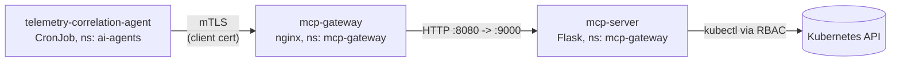

# MCP Server + Agent — Install Guide

End-to-end deployment order: **MCP server (behind the mTLS gateway) first, then the agent.**
Every command is copy-pasteable. Run everything from `agentic/laba/` unless noted.

## Architecture



- The **gateway** is the only entry point. It terminates TLS and verifies the caller's
  client certificate against the client CA (`mcp-client-ca`). No valid cert, no access.
- The **MCP server** exposes tools (`get_logs`, `get_pods`, `restart_deployment`) and is
  never reachable except through the gateway.
- The **agent** authenticates first (presents its client cert, calls `GET /tools`),
  and only then does its correlation work.

## Which repo has what

| Thing | Repo | Path |
|---|---|---|
| All Kubernetes manifests | `kubernetesclass` | `agentic/laba/yaml/` |
| MCP server source + Dockerfile | `kubernetesclass` | `agentic/laba/python/mcp-server.py`, `agentic/laba/docker/mcp_docker.txt` |
| Agent source (canonical) | `mcp_security` | `agents/telemetry-correlation-agent.py` |
| Agent source (deployable, MCP-auth enabled) + Dockerfile | `kubernetesclass` | `agentic/laba/python/telemetry-correlation-agent.py`, `agentic/laba/docker/telemetry_agent` |

> The `kubernetesclass` copy of the agent is the one to deploy — it includes the
> MCP authentication step. Sync it back to `mcp_security` when convenient.

## Prerequisites

- A Kubernetes cluster and `kubectl` pointed at it
- `docker` (or another builder) + push access to your registry (`gcr.io/PROJECT_ID`)
- `openssl`
- Replace `PROJECT_ID` with **your** project ID wherever you see it

---

## Part 1 — Deploy the MCP Server

### 1.1 Namespace and service accounts

```bash
cd agentic/laba/yaml

kubectl apply -f mcp-gateway-namespace.yaml
kubectl apply -f mcp-gateway-sa.yaml
```

### 1.2 Certificates and secrets

Generate the gateway's server certificate and the client CA
(the CA that will sign every agent's identity):

```bash
# Server certificate (what the gateway presents to callers)
openssl req -x509 -newkey rsa:2048 -nodes \
  -keyout server.key -out server.crt -days 365 \
  -subj "/CN=mcp-gateway"

# Client CA (signs agent client certificates)
openssl req -x509 -newkey rsa:2048 -nodes \
  -keyout ca.key -out ca.crt -days 365 \
  -subj "/CN=agent-client-ca"
```

> Keep `ca.key` safe — it mints agent identities. It never goes into the cluster.

Store them as secrets:

```bash
kubectl create secret tls mcp-server-tls \
  --cert=server.crt --key=server.key \
  -n mcp-gateway

kubectl create secret generic mcp-client-ca \
  --from-file=ca.crt \
  -n mcp-gateway
```

### 1.3 Gateway (nginx, mTLS enforcement)

```bash
kubectl apply -f mcp-nginx-config.yaml
kubectl apply -f mcp-gateway-deployment.yaml
kubectl apply -f mcp-gateway-service.yaml
```

### 1.4 Temporary echo backend (validates the gateway before any image builds)

```bash
kubectl apply -f mcp_server.yaml
```

Check everything is running:

```bash
kubectl get pods -n mcp-gateway
```

Both `mcp-gateway-*` and `mcp-server-*` pods should be `Running`.

### 1.5 Validate mTLS

Get the gateway's external IP (LoadBalancer):

```bash
export MCP_IP=$(kubectl get svc mcp-gateway -n mcp-gateway \
  -o jsonpath='{.status.loadBalancer.ingress[0].ip}')
echo "MCP Gateway IP: $MCP_IP"
```

Without a client cert — must be **rejected**:

```bash
curl -k https://$MCP_IP
# expected: 400 No required SSL certificate was sent
```

Issue yourself a test client cert and try again — must **succeed**:

```bash
openssl req -newkey rsa:2048 -nodes \
  -keyout client.key -out client.csr -subj "/CN=test-client"
openssl x509 -req -in client.csr \
  -CA ca.crt -CAkey ca.key -CAcreateserial \
  -out client.crt -days 90

curl -k --cert client.crt --key client.key https://$MCP_IP
# expected: HTTP 200 (echo response)
```

### 1.6 Swap in the real MCP server

Build and push the image:

```bash
cd agentic/laba
mkdir -p /tmp/mcp-build
cp docker/mcp_docker.txt /tmp/mcp-build/Dockerfile
cp python/mcp-server.py  /tmp/mcp-build/
docker build -t gcr.io/PROJECT_ID/mcp-server:lab1c /tmp/mcp-build
docker push gcr.io/PROJECT_ID/mcp-server:lab1c
```

Grant it RBAC (it runs `kubectl` inside the pod), then deploy.
Edit `PROJECT_ID` in `mcp-deployment.yaml` first:

```bash
cd yaml
kubectl apply -f mcp-server-rbac.yaml
kubectl apply -f mcp-deployment.yaml
```

Because the Deployment/Service names match the echo backend, this swaps
the backend **in place** — no gateway changes needed.

### 1.7 Validate the real server

```bash
curl -k --cert client.crt --key client.key https://$MCP_IP/tools
# expected: {"tools": ["get_logs", "restart_deployment", "get_pods"]}
```

**The MCP server is live. Do not continue until 1.5 and 1.7 behave as expected.**

---

## Part 2 — Deploy the Agent

### 2.1 Issue the agent's identity

Sign a client certificate with the **same client CA** from step 1.2:

```bash
openssl req -newkey rsa:2048 -nodes \
  -keyout telemetry-agent.key -out telemetry-agent.csr \
  -subj "/CN=telemetry-correlation-agent"

openssl x509 -req -in telemetry-agent.csr \
  -CA ca.crt -CAkey ca.key -CAcreateserial \
  -out telemetry-agent.crt -days 90
```

The CN is the agent's identity — the gateway forwards it to the MCP
server as the `X-Client-DN` header.

### 2.2 Create the namespace, then store the identity as a secret

```bash
cd agentic/laba/yaml

kubectl apply -f telemetry-agent.yaml     # creates ns ai-agents (CronJob pods stay Pending until 2.4)

kubectl create secret tls telemetry-agent-client-cert \
  --cert=telemetry-agent.crt --key=telemetry-agent.key \
  -n ai-agents
```

### 2.3 Build and push the agent image

```bash
cd agentic/laba
mkdir -p /tmp/telemetry-build
cp docker/telemetry_agent /tmp/telemetry-build/Dockerfile
cp python/telemetry-correlation-agent.py /tmp/telemetry-build/
docker build -t gcr.io/PROJECT_ID/telemetry-agent:lab1c /tmp/telemetry-build
docker push gcr.io/PROJECT_ID/telemetry-agent:lab1c
```

Edit `PROJECT_ID` in `yaml/telemetry-agent.yaml`.

### 2.4 Deploy sample telemetry and the agent

```bash
cd yaml
kubectl apply -f telemetry-sample-events.yaml
kubectl apply -f telemetry-agent.yaml
```

The CronJob runs every 5 minutes. Trigger a run right now:

```bash
kubectl create job telemetry-now \
  --from=cronjob/telemetry-correlation-agent -n ai-agents
```

### 2.5 Validate: authentication first, then work

```bash
kubectl logs -n ai-agents job/telemetry-now
```

Expected:

```text
=== MCP AUTHENTICATION ===
Gateway: https://mcp-gateway.mcp-gateway.svc.cluster.local
Authentication: SUCCESS
MCP tools available: ['get_logs', 'restart_deployment', 'get_pods']

=== CORRELATED FINDINGS ===
{ "student_id": "student-042", "risk_score": 95, "risk_level": "CRITICAL", ... }
{ "student_id": "student-017", "risk_score": 25, "risk_level": "MEDIUM", ... }
```

### 2.6 Prove Zero Trust (optional but great in class)

Replace the agent's cert with one signed by a rogue CA and re-run: the
gateway rejects it (`400`), the agent prints `Authentication: FAILED`
and exits **without processing any telemetry**. Restore the real secret
afterwards.

---

## Troubleshooting

| Symptom | Cause | Fix |
|---|---|---|
| Gateway pod `CrashLoopBackOff`, log says `host not found in upstream` | Old nginx config resolved the backend at startup | Use the current `mcp-nginx-config.yaml` (request-time DNS resolution) and `kubectl rollout restart deploy/mcp-gateway -n mcp-gateway` |
| `ImagePullBackOff` on `mcp-server` or the agent | Image not pushed, or `PROJECT_ID` not replaced | Build + push (1.6 / 2.3), edit the manifest, re-apply |
| Authenticated `curl` returns `502` | No backend behind the gateway | Apply `mcp_server.yaml` (1.4) or `mcp-deployment.yaml` (1.6) |
| `curl` returns `400 No required SSL certificate was sent` | No/expired client cert presented | That's mTLS working — present a cert signed by `ca.crt` |
| Agent: `Authentication: FAILED ... 400` | Cert not signed by the CA in `mcp-client-ca` | Re-issue the cert with the right `ca.crt`/`ca.key` (2.1) |
| `/tool/get_pods` returns errors | RBAC missing | `kubectl apply -f mcp-server-rbac.yaml` |

## Deployment checklist

- [ ] Namespace `mcp-gateway` + `mcp-gateway-sa` applied
- [ ] `mcp-server-tls` and `mcp-client-ca` secrets created
- [ ] Gateway (configmap + deployment + service) running
- [ ] Echo backend applied; no-cert curl → `400`; with-cert curl → `200`
- [ ] MCP server image built + pushed; `PROJECT_ID` edited
- [ ] `mcp-server-rbac.yaml` + `mcp-deployment.yaml` applied
- [ ] `GET /tools` through the gateway returns the tool list
- [ ] Agent client cert issued from the client CA; secret created in `ai-agents`
- [ ] Agent image built + pushed; `PROJECT_ID` edited
- [ ] Sample events + CronJob applied; manual job run
- [ ] Job logs show `Authentication: SUCCESS` **before** any findings
